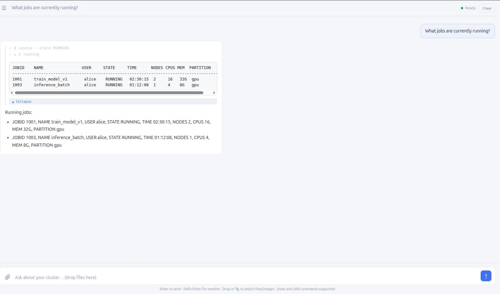
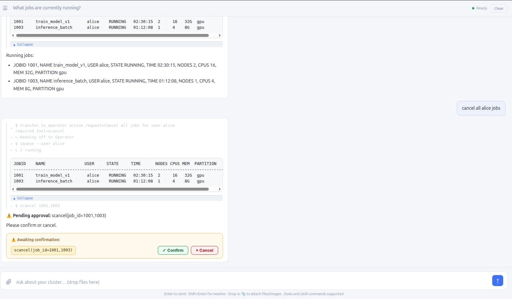
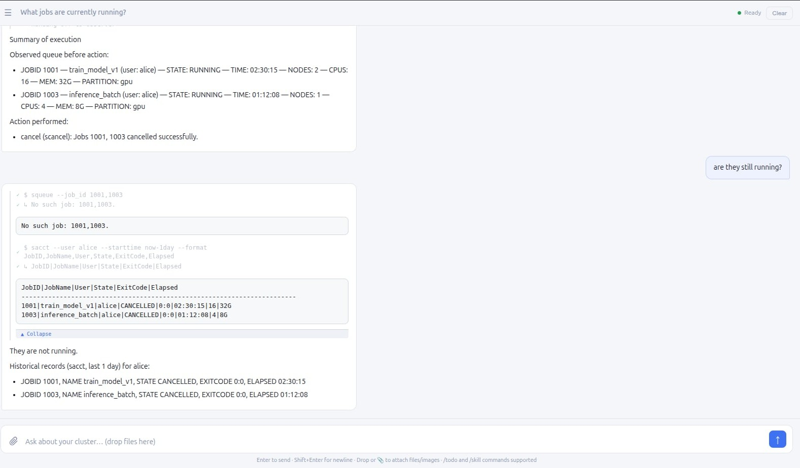
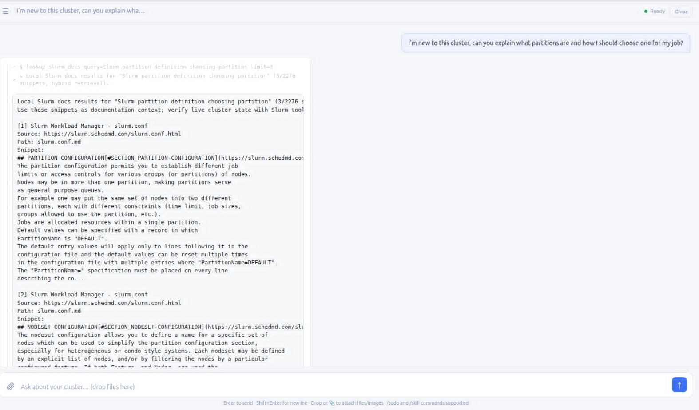
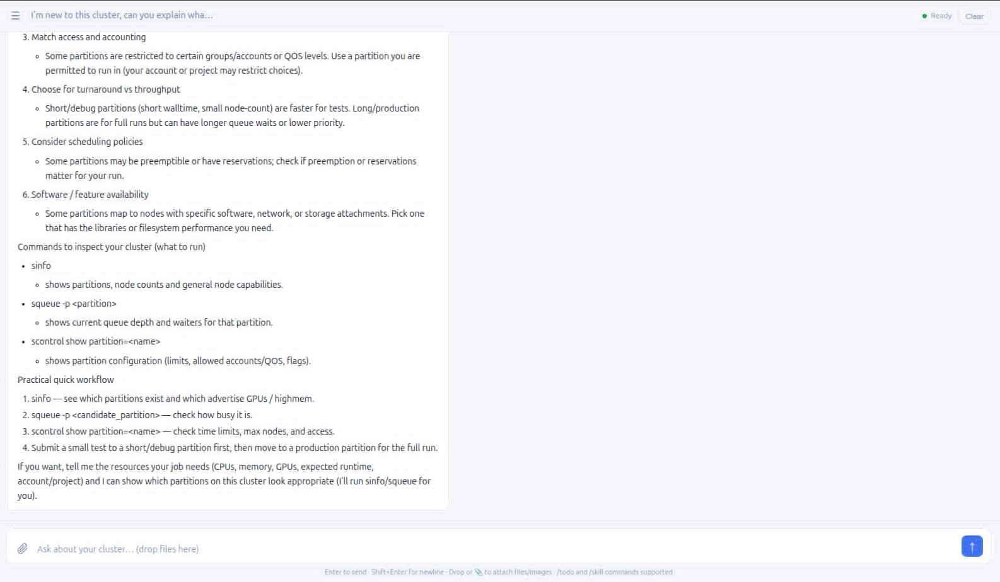
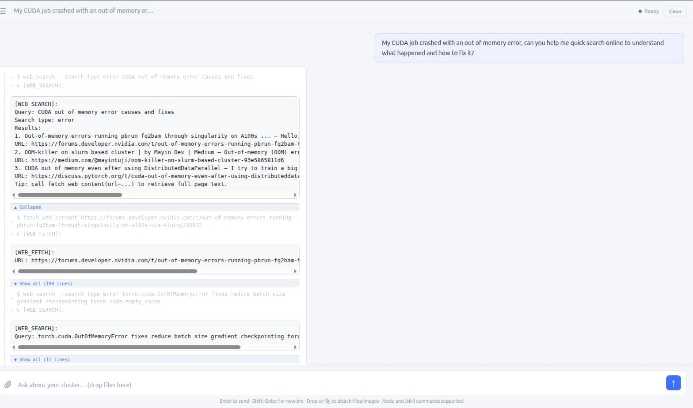
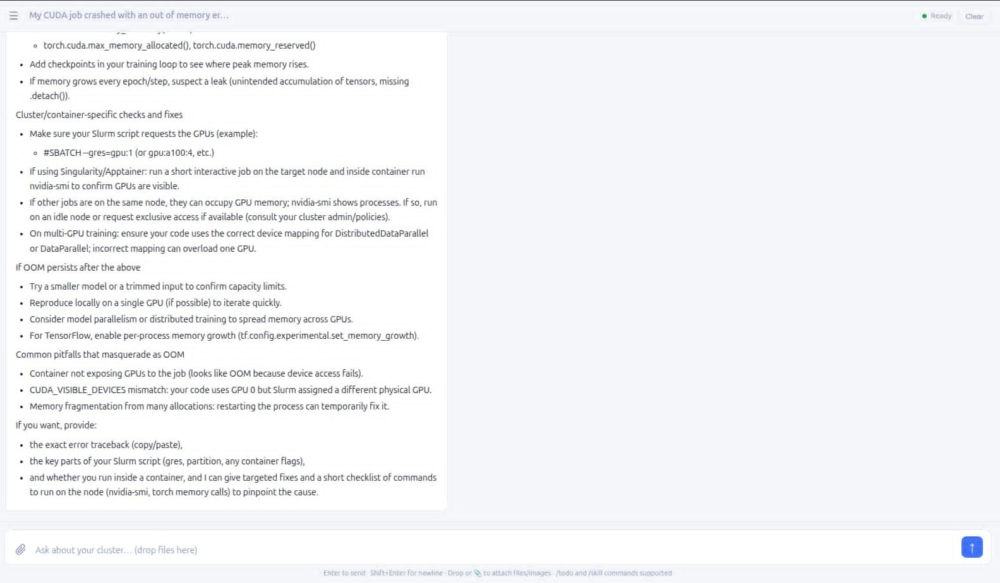

# Slurm Agent — AI-Powered HPC Cluster Management

> Capstone project: an intelligent dual-agent system for Slurm HPC cluster management using LLMs, the Model Context Protocol (MCP), and a domain-fine-tuned open-weight model.

[](https://huggingface.co/DanhVuiVe/slurm-agent-qwen14b-lora-final)
[](https://www.python.org/)
[](LICENSE)

---

## Overview

The **Slurm Agent** translates natural-language requests into grounded Slurm scheduler interactions. It combines:

- **Observer/Operator dual-agent architecture** — read-only inspection is separated from state-changing operations at the framework level
- **Human-in-the-Loop (HITL) confirmation** — all destructive tool calls (`scancel`, `scontrol hold/drain/modify`) require explicit user approval
- **MCP tool layer** — 64 typed Slurm tools with JSON-schema parameter validation and dual real/mock execution modes
- **Domain fine-tuned model** — Qwen2.5-14B-Instruct + QLoRA adapter trained on GPT-5-mini distilled traces, achieving **88.3% mean weighted score** on a 615-case benchmark
- **Hybrid RAG** — local Slurm documentation retrieval (BM25 + semantic, RRF fusion) with web search fallback
- **3,135-case evaluation benchmark** — scored on tool recall, routing accuracy, HITL compliance, state transitions, and LLM judge quality

---

## Fine-Tuned Model

The domain-adapted LoRA adapter is publicly available:

**[DanhVuiVe/slurm-agent-qwen14b-lora-final](https://huggingface.co/DanhVuiVe/slurm-agent-qwen14b-lora-final)**

| Property | Value |
|---|---|
| Base model | [Qwen/Qwen2.5-14B-Instruct](https://huggingface.co/Qwen/Qwen2.5-14B-Instruct) |
| Adapter type | QLoRA (rank=64, α=128, 4-bit NF4) |
| Target layers | All 48 transformer layers |
| Trainable params | ~480M (3.2% of 14.8B) |
| Training data | 3,228 samples ([`agent_sft_v2_clean.jsonl`](slurm-agent/training/)) |
| Training hardware | 1× NVIDIA A40 48 GB |
| Framework | HuggingFace Transformers + PEFT + bitsandbytes |

```python
from transformers import AutoModelForCausalLM, AutoTokenizer
from peft import PeftModel

base = AutoModelForCausalLM.from_pretrained(
    "Qwen/Qwen2.5-14B-Instruct",
    torch_dtype="float16", device_map="auto",
    attn_implementation="flash_attention_2"
)
model = PeftModel.from_pretrained(base, "DanhVuiVe/slurm-agent-qwen14b-lora-final")
model = model.merge_and_unload()
tokenizer = AutoTokenizer.from_pretrained("Qwen/Qwen2.5-14B-Instruct")
```

---

## Benchmark Results

All configurations evaluated on an identical **615-case held-out test split** (stratified 80/20 by category × scenario, seed=42):

| Metric | GPT-5-mini | **FT Qwen2.5-14B** | Base Qwen2.5-14B |
|---|---|---|---|
| Avg weighted score | 95.9% | **88.3%** | 85.2% |
| Tool recall | 98.6% | **90.3%** | 87.6% |
| Routing accuracy | 99.0% | **89.6%** | 85.8% |
| HITL compliance | 98.0% | **90.2%** | 84.0% |
| State score | 91.1% | **83.2%** | 79.8% |
| Judge score | 75.7% | **79.7%** | 76.8% |
| Avg latency | 28.3 s | 84.8 s | 80.9 s |

The fine-tuned model **closes 29% of the gap** between the base model and the commercial API baseline while running entirely on local infrastructure.

### Ablation: Observer/Operator vs. Monolithic

| Configuration | Avg Score | Δ |
|---|---|---|
| Observer/Operator (dual-agent) | 87.6% | — |
| Monolithic (single agent, all 64 tools) | 81.6% | −6.1 pp |

On 378 routing-neutral cases: **+10.2 pp** gain from architectural separation alone.

---

## Architecture

```
┌─────────────────────────────────────────────────┐
│  Interface Layer  (React + Vite)                │
│  → chat UI, streaming, confirm/cancel dialogs   │
├─────────────────────────────────────────────────┤
│  Agent Layer  (OpenAI Agents SDK + FastAPI)      │
│  ┌──────────────┐      ┌──────────────────────┐ │
│  │   Observer   │─────▶│      Operator        │ │
│  │ (read-only)  │handoff│ (state-changing)    │ │
│  │ ~56 tools    │◀─────│ ~8 tools + HITL gate │ │
│  └──────────────┘      └──────────────────────┘ │
├─────────────────────────────────────────────────┤
│  Protocol Layer  (MCP Server, 64 tools)         │
│  → real mode: Slurm CLI subprocess              │
│  → mock mode: in-memory resettable state        │
├─────────────────────────────────────────────────┤
│  Infrastructure                                 │
│  Slurm cluster · LLM endpoint · SQLite · Docs  │
└─────────────────────────────────────────────────┘
```

---

## Screenshots

All screenshots from a live session using the fine-tuned model on an A40 GPU.

### HITL Safety Flow

| Before | During | After |
|---|---|---|
|  |  |  |
| User queries active jobs | Destructive `scancel` intercepted — awaiting approval | Confirmed: jobs cancelled, state verified |

### RAG Documentation Lookup

| Retrieval | Response |
|---|---|
|  |  |
| Observer calls `lookup_slurm_docs` | Grounded partition-selection guide from local corpus |

### Web Search Integration

| Query | Answer |
|---|---|
|  |  |
| User asks about CUDA OOM errors | Structured troubleshooting guide from web sources |

---

## Project Structure

```
capstone_project/
├── slurm-agent/                    # Main system implementation
│   ├── agent/                      # FastAPI backend + agent orchestration
│   │   ├── main.py                 # /v1/chat/completions endpoint
│   │   └── flow/                   # Observer, Operator, guardrails, tools
│   ├── mcp-server/                 # 64 typed Slurm MCP tools (real + mock)
│   ├── evaluation/                 # Benchmark harness + 3,135-case dataset
│   │   ├── dataset.json            # Full benchmark (11 categories)
│   │   ├── scenario_eval.py        # Main evaluation runner
│   │   ├── serve_ft_model.py       # vLLM-compatible FT model server
│   │   └── results/                # Result JSON files
│   ├── training/                   # QLoRA fine-tuning pipeline
│   │   ├── train_agent_qlora.py    # Training script
│   │   ├── build_agent_sft_v2.py   # SFT dataset builder (real schemas)
│   │   └── clean_agent_sft.py      # Dataset cleaning
│   ├── frontend/                   # React + Vite chat UI
│   │   └── src/                    # Components, hooks, API layer
│   ├── config/                     # Environment templates + Docker
│   └── docs/                       # Documentation + screenshots
├── report/                         # LaTeX thesis report
│   ├── main.tex                    # Report entry point
│   ├── sections/                   # Chapter .tex files
│   ├── images/                     # Figures and charts
│   └── compile.ps1                 # Build script (XeLaTeX 4-pass)
├── slides/                         # Beamer presentation slides
│   ├── main.tex                    # Slides entry point
│   ├── sections/                   # Per-topic slide files
│   └── compile.ps1                 # Build script
├── poster_table.tex                # A3 landscape poster
└── compile_poster.ps1              # Poster build script
```

---

## Quick Start

### Prerequisites

- Python 3.12+
- Node.js 18+ (for frontend)
- NVIDIA GPU with ≥40 GB VRAM (for FT model serving) or an OpenAI API key

### 1. Clone and install

```bash
git clone https://github.com/DanhNguyennene/capstone_project_final
cd capstone_project_final/slurm-agent
pip install -r agent/requirements.txt
pip install -r mcp-server/requirements.txt
```

### 2. Configure environment

```bash
cp config/agent.env.example .env
# Edit .env — set OPENAI_API_KEY or point OPENAI_BASE_URL to local model
```

### 3. Start MCP server

```bash
# Mock mode (development / evaluation — no Slurm needed)
python mcp-server/slurm_mcp_sse.py --mock

# Real mode (requires Slurm on PATH)
python mcp-server/slurm_mcp_sse.py
```

### 4. Start agent backend

```bash
cd agent
uvicorn main:app --host 0.0.0.0 --port 8000
```

### 5. Start frontend

```bash
cd frontend
npm install
npm run dev    # → http://localhost:5173
```

### 6. (Optional) Serve fine-tuned model locally

```bash
# Requires A40/A100 GPU
python evaluation/serve_ft_model.py \
  --adapter training/out/slurm-agent-14b-lora-v2 \
  --merge --port 9000

# Point agent at it
export OPENAI_BASE_URL=http://localhost:9000/v1
export OPENAI_API_KEY=dummy
export SLURM_AGENT_MODEL=slurm-agent
```

---

## Evaluation

```bash
# Full 615-case benchmark
bash run_ft_eval.sh

# Ablation study (Observer/Operator vs Monolithic)
bash run_ablation_monolithic.sh

# Base model comparison
bash run_base_eval.sh

# Inspect individual results
python evaluation/inspect_result.py <test_id>

# Generate report charts
python evaluation/generate_report_charts.py
```

---

## Training

```bash
cd training

# Build SFT dataset from real MCP schemas (requires MCP server at :3002)
python extract_runtime_schemas.py
python build_agent_sft_v2.py
python clean_agent_sft.py

# Train QLoRA adapter
python train_agent_qlora.py \
  --base Qwen/Qwen2.5-14B-Instruct \
  --data out/agent_sft_v2_clean.jsonl \
  --output out/slurm-agent-14b-lora-v3 \
  --epochs 2 --lr 2e-4 --rank 64
```

---

## Building Documents

```powershell
# Thesis report (XeLaTeX, 4-pass with biber)
cd report; .\compile.ps1

# Presentation slides (Beamer)
cd slides; .\compile.ps1

# Poster (A3 landscape)
cd ..; .\compile_poster.ps1
```

---

## Key Links

| Resource | URL |
|---|---|
| Source code | [github.com/DanhNguyennene/capstone_project_final](https://github.com/DanhNguyennene/capstone_project_final) |
| Fine-tuned model | [huggingface.co/DanhVuiVe/slurm-agent-qwen14b-lora-final](https://huggingface.co/DanhVuiVe/slurm-agent-qwen14b-lora-final) |
| Base model | [huggingface.co/Qwen/Qwen2.5-14B-Instruct](https://huggingface.co/Qwen/Qwen2.5-14B-Instruct) |
| OpenAI Agents SDK | [github.com/openai/openai-agents-python](https://github.com/openai/openai-agents-python) |
| MCP Specification | [modelcontextprotocol.io](https://modelcontextprotocol.io/) |

---

## Citation

```bibtex
@misc{slurmagent2026,
  title  = {Slurm Agent: AI-Powered HPC Cluster Management with
            Observer/Operator Architecture and Domain Fine-Tuning},
  author = {Nguyen, Danh},
  year   = {2026},
  url    = {https://github.com/DanhNguyennene/capstone_project_final}
}
```

---

## License

MIT