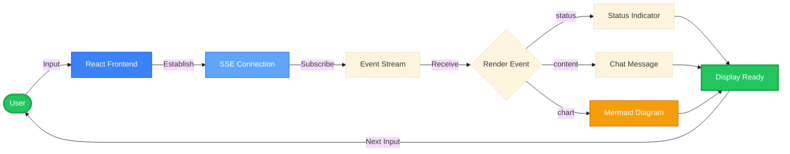
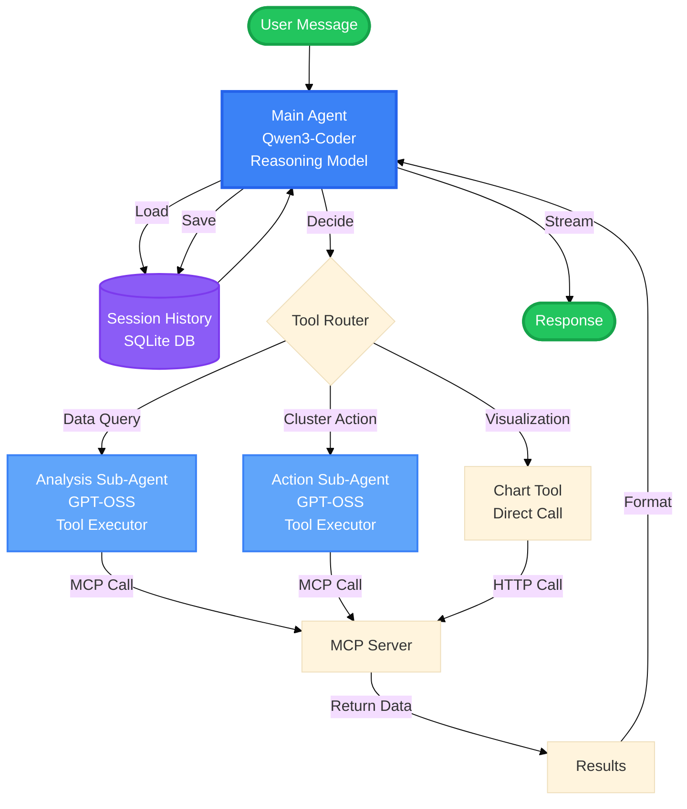
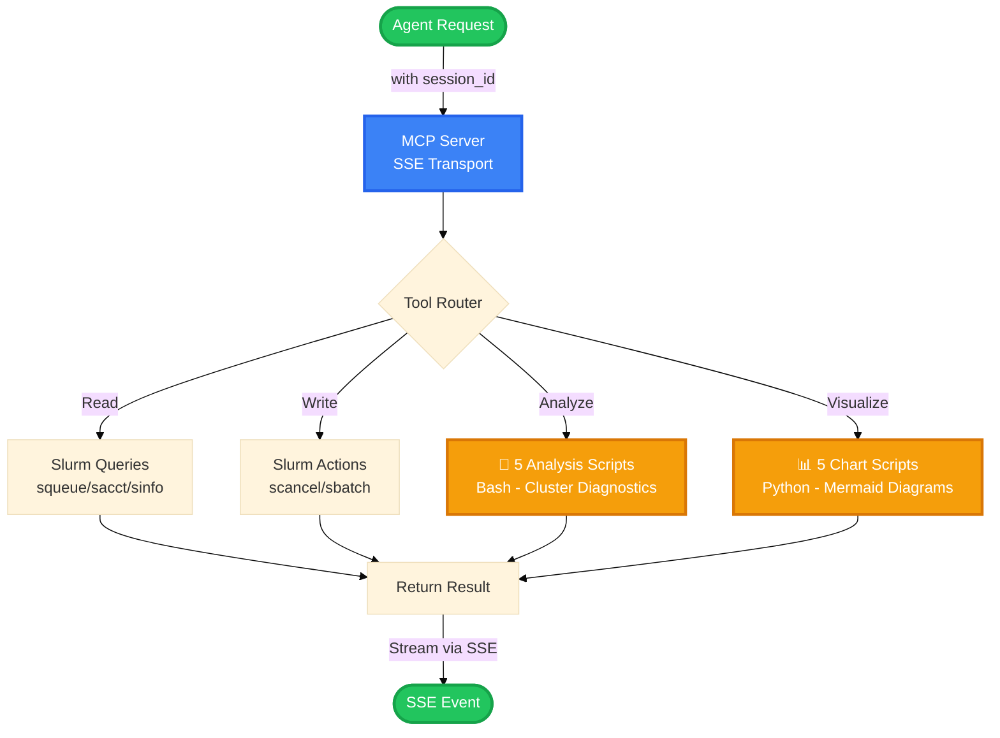
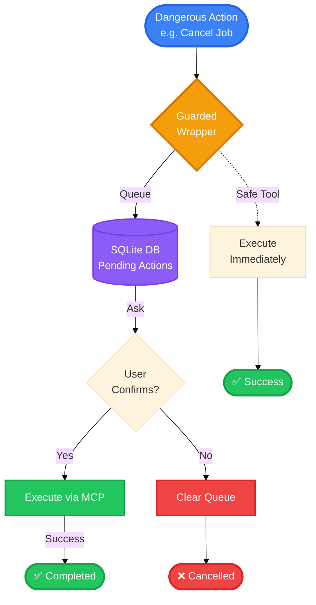
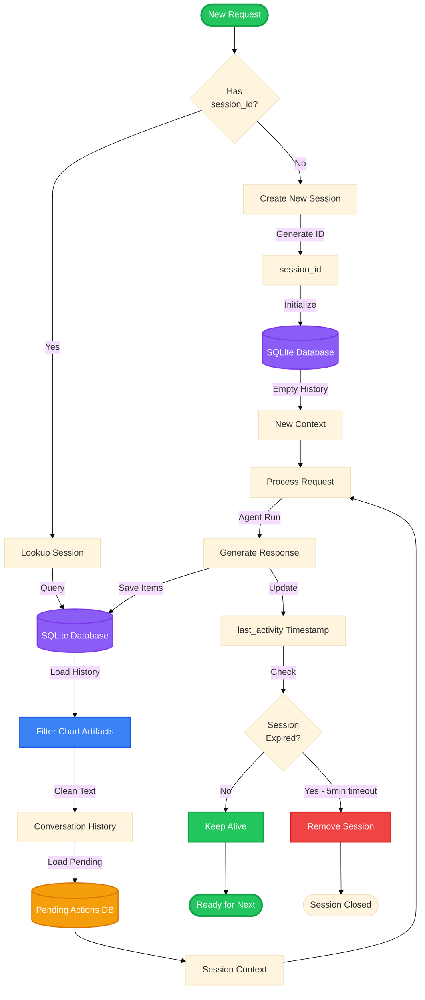
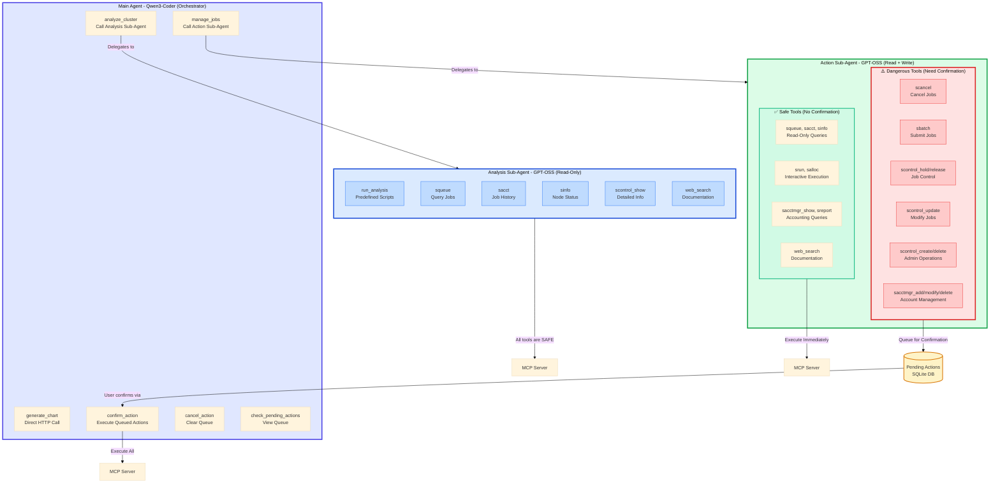

# System Module Diagrams - Conceptual View

This document contains all conceptual diagrams for each module of the Slurm Agent system.

---

## 1. Frontend Module

**Concept**: User interaction and real-time streaming interface

**Key Components**:
- React UI with TypeScript
- SSE connection for real-time updates
- Event-driven rendering (status/content/chart)
- Mermaid.js for interactive diagrams

---

## 2. Agent Orchestration Module

**Concept**: Multi-agent system with reasoning and execution models

**Key Components**:
- Main Agent (Qwen3-Coder) for reasoning
- Sub-Agents (GPT-OSS) for precise tool execution
- SQLite for conversation history
- Tool router for delegation

---

## 3. MCP Server Module

**Concept**: Stateful SSE transport with tool routing

**Key Components**:
- SSE session management with session_id
- Tool routing to 5 categories
- Stateful bidirectional communication
- Response via SSE stream

---

## 4. Predefined Scripts Module

**Concept**: Pre-built analysis and visualization scripts

```mermaid
%%{init: {'theme':'base', 'themeVariables': { 'fontSize':'16px'}}}%%
flowchart LR
    subgraph Analysis["Analysis Scripts (Bash)"]
        direction TB
        A1[analyze_my_jobs.sh<br/>Current job status]
        A2[analyze_failed_jobs.sh<br/>Failure diagnostics]
        A3[analyze_pending_jobs.sh<br/>Queue bottlenecks]
        A4[analyze_cluster_status.sh<br/>Overall health]
        A5[analyze_gpu_resources.sh<br/>GPU availability]
    end
    
    subgraph Charts["Chart Scripts (Python)"]
        direction TB
        C1[chart_system_health.py<br/>Health dashboard]
        C2[chart_cluster_topology.py<br/>Node hierarchy]
        C3[chart_pending_analysis.py<br/>Queue diagnosis]
        C4[chart_job_lifecycle.py<br/>Job timeline]
        C5[chart_resource_map.py<br/>Resource allocation]
    end
    
    MCP[MCP Tool Router] -->|run_analysis| Analysis
    MCP -->|generate_chart| Charts
    
    Analysis -->|Execute| Slurm[Slurm Commands]
    Charts -->|Query + Generate| Mermaid[Mermaid Diagrams]
    
    Slurm -->|Output| Result[Structured Data]
    Mermaid -->|Output| Result
    Result --> Return([Return to Agent])
    
    style MCP fill:#3b82f6,stroke:#2563eb,stroke-width:3px,color:#fff
    style Analysis fill:#f59e0b,stroke:#d97706,stroke-width:2px
    style Charts fill:#f59e0b,stroke:#d97706,stroke-width:2px
    style Slurm fill:#8b5cf6,stroke:#7c3aed,stroke-width:2px,color:#fff
    style Mermaid fill:#ec4899,stroke:#db2777,stroke-width:2px,color:#fff
    style Return fill:#22c55e,stroke:#16a34a,stroke-width:3px,color:#fff
```

**Key Components**:
- 5 analysis scripts (Bash) - cluster diagnostics
- 5 chart scripts (Python) - Mermaid diagram generation
- Direct Slurm command execution
- Structured output for agent consumption

---

## 5. Confirmation/Safety Module

**Concept**: Safety guardrails for dangerous operations

**Key Components**:
- Guarded wrapper intercepts dangerous operations
- SQLite persistent queue
- User confirmation flow
- Safe tools bypass confirmation

---

## 6. Session Management Module

**Concept**: Persistent conversation state and history

**Key Components**:
- session_id based tracking
- SQLite persistent storage
- Chart artifact filtering (removes HTML from history)
- Session timeout (5 minutes)
- Context preservation across requests

---

---

## 7. Agent Tool Access & Safety Model

**Concept**: Role-based tool access with safety guardrails

**Key Components**:

### **Tool Access Matrix**

| Tool Category | Tool Name | Agent Access | Safety | Description | Reason |
|--------------|-----------|--------------|--------|-------------|---------|
| **Query Tools** | `squeue` | Analysis, Action | ✅ Safe | View job queue status | Read-only, no state change |
| | `sacct` | Analysis, Action | ✅ Safe | Query job history & accounting | Read-only, historical data |
| | `sinfo` | Analysis, Action | ✅ Safe | View node/partition status | Read-only, cluster info |
| | `scontrol_show` | Analysis, Action | ✅ Safe | Detailed job/node info | Read-only, diagnostic |
| **Analysis** | `run_analysis` | Analysis | ✅ Safe | Execute predefined scripts | Read-only queries only |
| | `web_search` | Analysis, Action | ✅ Safe | Search documentation/solutions | External, no cluster impact |
| **Interactive** | `srun` | Action | ✅ Safe | Run command on nodes | User's own allocation |
| | `salloc` | Action | ✅ Safe | Allocate resources | User's own resources |
| **Reporting** | `sacctmgr_show` | Action | ✅ Safe | View accounts/users/QOS | Read-only accounting |
| | `sreport` | Action | ✅ Safe | Generate usage reports | Read-only statistics |
| **Job Control** | `scancel` | Action | ⚠️ Dangerous | Cancel jobs | Terminates running jobs |
| | `sbatch` | Action | ⚠️ Dangerous | Submit batch job | Creates new jobs |
| | `scontrol_hold` | Action | ⚠️ Dangerous | Prevent job from starting | Modifies job state |
| | `scontrol_release` | Action | ⚠️ Dangerous | Allow held job to run | Modifies job state |
| | `scontrol_update` | Action | ⚠️ Dangerous | Change job parameters | Alters running jobs |
| | `scontrol_requeue` | Action | ⚠️ Dangerous | Restart failed job | Resets job state |
| **Admin Ops** | `scontrol_create` | Action | ⚠️ Dangerous | Create partition/reservation | Changes cluster config |
| | `scontrol_delete` | Action | ⚠️ Dangerous | Delete partition/reservation | Removes cluster resources |
| | `scontrol_reconfigure` | Action | ⚠️ Dangerous | Reload Slurm config | Affects entire cluster |
| **Accounting** | `sacctmgr_add` | Action | ⚠️ Dangerous | Add account/user/QOS | Modifies accounting DB |
| | `sacctmgr_modify` | Action | ⚠️ Dangerous | Update account settings | Changes permissions |
| | `sacctmgr_delete` | Action | ⚠️ Dangerous | Remove account/user | Revokes access |
| **Visualization** | `generate_chart` | Main Agent | ✅ Safe | Create Mermaid diagrams | Read-only visualization |
| **Confirmation** | `confirm_action` | Main Agent | 🔐 Protected | Execute queued actions | User-approved only |
| | `cancel_action` | Main Agent | 🔐 Protected | Clear action queue | User control |
| | `check_pending_actions` | Main Agent | ✅ Safe | View queued actions | Read-only queue status |

### **Safety Model**
1. **Analysis Sub-Agent** → Only safe tools → Execute immediately
2. **Action Sub-Agent + Safe Tool** → Execute immediately
3. **Action Sub-Agent + Dangerous Tool** → Queue to DB → User confirms → Execute
4. **Main Agent** → Never directly calls Slurm tools → Delegates to sub-agents

### **Compact Table for Slides**

| Tool Category | Main | Analysis | Action | Safety | Purpose |
|--------------|------|----------|--------|--------|---------|
| **Slurm Query** (squeue/sacct/sinfo) | ❌ | ✅ | ✅ | ✅ | Query cluster state |
| **Analysis Scripts** (5 bash scripts) | ❌ | ✅ | ❌ | ✅ | Predefined diagnostics |
| **Chart Scripts** (5 python scripts) | ✅ | ❌ | ❌ | ✅ | Mermaid visualization |
| **Web Search** | ❌ | ✅ | ✅ | ✅ | Documentation lookup |
| **Interactive** (srun/salloc) | ❌ | ❌ | ✅ | ✅ | User resources |
| **Job Control** (scancel/sbatch) | ❌ | ❌ | ✅ | ⚠️ | Modify jobs |
| **Admin Ops** (scontrol_*) | ❌ | ❌ | ✅ | ⚠️ | Cluster config |
| **Accounting** (sacctmgr_*) | ❌ | ❌ | ✅ | ⚠️ | User/account mgmt |
| **Confirmation** (confirm/cancel) | ✅ | ❌ | ❌ | 🔐 | User approval |

**Legend**: ✅ Access | ❌ No Access | ⚠️ Needs confirmation | 🔐 Protected flow

---

## Summary

All 7 modules work together to provide:
- **Stateful conversational AI** for HPC cluster management
- **Safety guardrails** for dangerous operations
- **Role-based tool access** with least-privilege principle
- **Pre-built analysis and visualization** tools
- **Persistent session state** across requests
- **Real-time streaming** user experience
